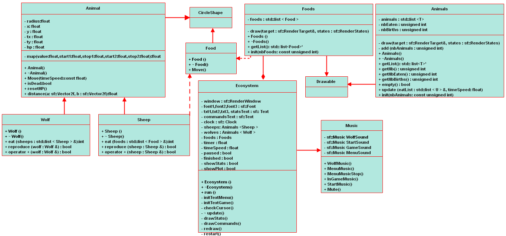

<br/> Ce jeu est une simulation en C++ d'un écosystème simple, où des moutons et des loups évoluent.


## Installation

Pour réaliser ce projet, nous avons utilisé la librairie graphique **SFML** sous Linux.
Pour l'installer, rien de plus simple :
```bash
sudo apt-get install libsfml-dev
```
Si vous utiliser un autre système d'exploitation cf la documentation [ici](https://www.sfml-dev.org/tutorials/2.5/index-fr.php).

## Compilation et lancement du jeu
Pour compiler notre jeu, utiliser la commande **make** puis lancer l'exécutable *game* avec la commande:
```bash
./game
```


Une fenêtre de lancement apparait avec une musique immersif qui l'on espére vous plaira ainsi qu'un bouton **START**. Une fois le bouton appuyé, la fenêtre du jeu s'ouvre et la simulation démarre en appuyant sur la touche 'Enter'.


[comment]: <> (

## Commandes

Voici les commandes de l'application :

- `Enter` : démarrer la simulation
- `Space` : mettre la simulation sur pause
- `Right arrow` : accélérer la simulation par 2
- `Left arrow` : ralentir la simulation par 2
- `S` : afficher/masquer les statistiques

## Fonctionnement du jeu
- Les animaux sont représentés par des cercles. Les moutons correspondent aux cercles oranges et les loups au cercles bleus, plus gros. La simulation débute avec 30 moutons et 8 loups, tous placés aléatoirement sur la fenêtre et ayant 1000 de point de vie.

- En petit cercle blanc sont représentés la nourriture.

- À chaque régénération de la fenêtre , les animaux se déplacent pseudo-aléatoirement en utilisant le bruit de Perlin (*Perlin noise*). Leurs points de vie diminuent d'un point par déplacement.

- Deux entités interagissent entre elles lorsque les cercles qui les représentent se superposent. Voici les interactions entre les entités :

    * **Quand un mouton rencontre de la nourriture**, le mouton mange la nourriture. La nourriture est régénérée à un autre endroit de la fenêtre et le mouton régénère ses points de vie à la valeur de départ.
    * **Quand un loup rencontre un mouton**, le loup mange le mouton. Le loup régénère ses points de vie, et le mouton disparaît.
    * **Quand un mouton rencontre un autre mouton**, un nouveau mouton naît avec une certaine probabilité (définie à `0.3`).
    * **Quand un loup rencontre un autre loup**, un nouveau loup naît avec une certaine probabilité (définie à `0.3`).
    * **Quand un animal n'a plus de points de vie**, il meurt et disparaît de la fenêtre.

## Personnalisation
Evidemment, vous pouvez faire varier les paramètres de la simulation comme bon vous semble ! Elles se situent dans le fichier **constants.hpp** du dossier `src`.

## Statistiques
Vous pouvez voir les statistiques de la simulation en haut à gauche de la fenêtre :

- Le temps en secondes
- La vitesse de la simulation
- Le nombre actuel de moutons
- La nombre actuel de loups
- Le nombre total de nourritures mangées par les moutons
- Le nombre total de moutons tués par les loups
- Le nombre de moutons nés
- Le nombre de loups nés

Le mot `Paused` s'affiche si la simulation est sur pause.

## Résultat de la simulation

À la fin de la simulation, un graphique apparaît montrant l'évolution du nombre de loups et de moutons en fonction du temps.
Celui-ci est généré grâce à [pbPlots](https://github.com/InductiveComputerScience/pbPlots).


## Tests
Pour vérifier le bon fonctionnement de nos classes, nous avons effectuer plusieurs tests à l'aide de la librairie **catch** que vous pourrez retrouver [ici](https://github.com/Amine695/Game-of-Life-/blob/main/tests/Testcase.cpp).
Pour compiler, utiliser la commande `make testcase` dans le répertoire principale puis `./testcase`.

## Fonctionnalités de notre application
- [x] Créer la fenêtre de lancement
- [x] Créer la fenêtre de simulation
- [x] Définir les classes pour les animaux
- [x] Gérer le déplacement des animaux
- [x] Définir la classe pour la nourriture
- [x] Gérer les interactions entre les entités
- [x] Ajouter sur la fenêtre les statistiques de la simulation
- [x] Gérer la customisation de la simulation
- [x] Utilisation de tests unitaires
- [x] Pouvoir faire pause, accélérer, ralentir la simulation
- [x] Pouvoir générer un graphe de la simulation avec le nombre d'animaux en fonction du temps
- [x] Gérer la partie audio du jeu avec les différents sons
- [x] Respecter les contraintes du projet (fonctions virtuelles, héritage,...)

## Diagramme UML



## Auteurs
**Amine Berbagui** <br/>
**Ghassen Hachani**
